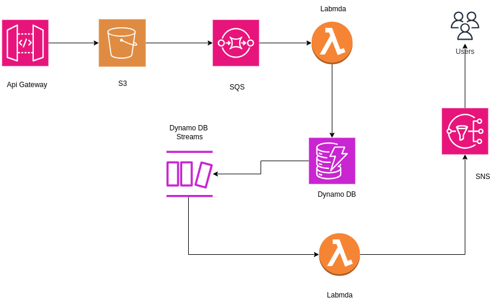

# Automated Document Processing Architecture

This project demonstrates an end-to-end serverless architecture using AWS services for automated document processing. The system uploads documents to an S3 bucket, processes the content using AWS Textract, and stores extracted information in DynamoDB. The architecture also includes SQS for decoupling components and SNS for sending notifications after processing.

## Architecture Overview



## Services Used

- **IAM policies and roles**:  Necessary permissions for various AWS services to interact with each other securely
- **API Gateway**: Front end for uploading documents and interacting with the processing system.
- **S3**: Storage for uploaded documents.
- **Lambda**: Function to process the uploaded documents and extract text using Textract.
- **AWS Textract**: For extracting structured data (text) from the uploaded documents.
- **DynamoDB**: For storing processed results from the document.
- **SQS**: For decoupling the processing steps and handling errors using Dead-Letter Queues.
- **DynamoDB Streams**: For triggering the second Lambda function to handle post-processing tasks.
- **SNS**: For sending notifications after processing.

## Task 1 Creating IAM policies and roles

To create the necessary **IAM policies and roles** for the services in the document processing pipeline, follow these steps:

### Step 1.1: Creating Custom IAM Policies

1. Open the IAM console.
2. Navigate to **Policies** in the left-hand panel.
3. Click **Create Policy**.
4. Under **Service**, choose the relevant services (e.g., S3, DynamoDB, Textract).
5. Specify the necessary actions and resources.
6. Review the policy and give it a descriptive name.
7. Save the policy.

Follow the above steps and create the following policies:

### Name: `api-gateway-upload-to-s3-policy`

```json
{
    "Version": "2012-10-17",
    "Statement": [
        {
            "Sid": "VisualEditor0",
            "Effect": "Allow",
            "Action": [
                "s3:PutObject",
                "s3:GetObject"
            ],
            "Resource": "arn:aws:s3:::mybucketName/*"
        }
    ]
}
```

### Name: `Lambda-Read-SQS`

```json
{
    "Version": "2012-10-17",
    "Statement": [
        {
            "Sid": "Statement1",
            "Effect": "Allow",
            "Action": [
                "sqs:*"
            ],
            "Resource": [
                "*"
            ]
        }
    ]
}
```

### Name: `Lambda-Write-DynamoDB`

```json
{
    "Version": "2012-10-17",
    "Statement": [
        {
            "Sid": "Statement1",
            "Effect": "Allow",
            "Action": [
                "dynamodb:PutItem",
                "dynamodb:DescribeTable"
            ],
            "Resource": [
                "*"
            ]
        }
    ]
}
```

### Name: `Lambda-Process-Text`

```json
{
    "Version": "2012-10-17",
    "Statement": [
        {
            "Sid": "Statement1",
            "Effect": "Allow",
            "Action": [
                "textract:*"
            ],
            "Resource": [
                "*"
            ]
        }
    ]
}
```

### Name: `Lambda-DynamoDBStreams-Read`

```json
{
    "Version": "2012-10-17",
    "Statement": [
        {
            "Sid": "Statement1",
            "Effect": "Allow",
            "Action": [
                "dynamodb:*"
            ],
            "Resource": [
                "*"
            ]
        }
    ]
}
```

### Name: `Lambda-SNS-Publish`

```json
{
    "Version": "2012-10-17",
    "Statement": [
        {
            "Sid": "Statement1",
            "Effect": "Allow",
            "Action": [
                "sns:Publish",
                "sns:GetTopicAttributes"
            ],
            "Resource": [
                "*"
            ]
        }
    ]
}
```

### Name: `LambdaS3AccessPolicy`

```json
{
    "Version": "2012-10-17",
    "Statement": [
        {
            "Effect": "Allow",
            "Action": [
                "s3:GetObject"
            ],
            "Resource": "*"
        }
    ]
}
```

### Step 1.2: Creating IAM Roles and Attaching Policies to the Roles

1. Open the IAM console.
2. Navigate to **Roles** in the left-hand panel.
3. Click **Create Role**.
4. Under **Trusted Entity Type**, select **AWS Service**.
5. Choose the service that will use the role (e.g., Lambda, API Gateway).
6. Attach the corresponding custom IAM policies you created.
7. Name the role.
8. Review and create the role.

Follow the above steps and create the following roles:

### Creating Role for API Gateway to Upload to S3

- **Trusted Entity**: API Gateway
- **Policies Attached**: `api-gateway-upload-to-s3-policy`
- **Role Name**: `ApiGatewayUploadRole`

### Creating Role for Lambda to Read from SQS,  Write to DynamoDB  , Process Text using Textract , send log to cloud watch , and get objects from S3 bucket

- **Trusted Entity**: Lambda
- **Policies Attached**: `Lambda-Read-SQS`, `Lambda-Write-DynamoDB` , `Lambda-Process-Text` , `AWSLambdaBasicExecutionRole` ,`LambdaS3AccessPolicy`
- **Role Name**: `LambdaDocumentProcessingRole`

### Creating Role for Lambda to Read from DynamoDB Streams and Publish to SNS

- **Trusted Entity**: Lambda
- **Policies Attached**: `Lambda-DynamoDBStreams-Read`, `Lambda-SNS-Publish`
- **Role Name**: `LambdaDynamoDBStreamsAndSNSRole`

## Task 2: Create an S3 Bucket

Follow these steps to create an s3 bucket that will store the document:

1. Open the **Amazon S3 console**.
2. Click **Create bucket**.
3. Enter a unique **Bucket name**.
4. Choose the **AWS Region** where you want to create the bucket.
5. Configure any additional settings as needed (e.g., versioning, encryption).
6. Click **Create bucket**.

## Task 3: Creating a DynamoDB Table

Follow these steps to create a DynamoDB table that will store the extracted document processing results:

1. Open the **Amazon DynamoDB console**.
2. Click on **Create table**.
3. Enter a **Table name** (e.g., `DocumentProcessingResults`).
4. Specify the **Primary key**:
    - **Partition key**: `DocumentID` (String)
    - Optionally, you can add a **Sort key** depending on your use case.
5. In **Table settings**:
    - You can enable **DynamoDB Streams** which triggers another Lambda function for post-processing tasks.
6. Review your settings and click **Create table**.

## Task 4: Creating an SQS Queue

To create an Amazon SQS queue for decoupling components in the document processing pipeline, follow these steps:

1. Open the **Amazon SQS console**.
2. Click on **Create queue**.
3. Choose the **Queue type**:
    - **Standard queue**: Offers nearly unlimited throughput and ensures at least one delivery.
4. Enter a **Queue name** (e.g., `DocumentProcessingQueue`).
5. Under **Configuration**, leave everything as default.
6. Under **Encryption**, leave everything as default.
7. Under **Access policy**:
    - Choose **Basic** under the method.
    - Define who can send messages to the queue:
      - Choose **Only the specified AWS accounts, IAM users, and roles**.
      - In the box provided, paste the Amazon Resource Name (ARN) of the **APIGateway-SQS IAM role**.
8. Review the configuration, and click **Create queue**.

### Step 4.1: Editing the Queue's Access Policy

Once the queue is created, follow these steps to modify its access policy:

1. Go to the **SQS console** and navigate to the **queue list**.
2. Select your queue and go to the **Access policy** section.
3. Click **Edit** to modify the access policy.
4. Replace the default policy with the following policy:

```json
{
  "Version": "2012-10-17",
  "Id": "Policy1725887183823",
  "Statement": [
    {
      "Sid": "Stmt1725887178304",
      "Effect": "Allow",
      "Principal": "*",
      "Action": "sqs:*",
      "Resource": "arn:aws:sqs:Region:accountId:queueName",
      "Condition": {
        "ArnEquals": {
          "aws:SourceArn": "arn:aws:s3:::mybucketName"
        }
      }
    }
  ]
}
```

### Task 5: Creating a Lambda Function for the `LambdaDocumentProcessingRole` Role

In this task, you will create a Lambda function that processes messages from the SQS queue and writes data to DynamoDB.

### Step 5.1: Create the Lambda Function

1. Open the **AWS Lambda console**.
2. Click on **Create function**.
3. Choose the **Author from scratch** option.
4. Enter the **Function name** (e.g., `DocumentProcessingLambda`).
5. Choose the **Runtime** (e.g., **Python 3.9**).
6. Under **Permissions**, choose **Use an existing role** and select the `LambdaDocumentProcessingRole` role from the dropdown list.
7. Click **Create function**.

### Step 5.2: Setting Up Amazon SQS as a Trigger to Invoke the Function

1. **Navigate to the Lambda function** you just created.
2. In the **Function details** page, scroll down to the **Function overview** section.
3. Click on **Add trigger**.
4. From the **Trigger configuration** dropdown, select **SQS**.
5. In the **SQS queue** field, choose the SQS queue you created earlier (e.g., `DocumentProcessingQueue`).
6. **Click** **Add** to attach the SQS trigger to your Lambda function.

### Step 5.3: Configure Lambda Function Code

1. In the Lambda function details page, scroll down to the **Function code** section.
2. Replace the default code with your custom implementation. For example, if you're using Python, your `fun1.py` might look something like this:

    - Check this repository for `fun1.py`:

    ```python
    import json
    import boto3

    dynamodb = boto3.resource('dynamodb')
    table = dynamodb.Table('YourDynamoDBTableName')

    def lambda_handler(event, context):
        for record in event['Records']:
            # Process SQS message
            message = record['body']
            
            # Write to DynamoDB
            response = table.put_item(
                Item={
                    'PrimaryKey': 'unique-key',
                    'Data': message
                }
            )
            print(f"Successfully processed message: {message}")
        
        return {
            'statusCode': 200,
            'body': json.dumps('Processing complete.')
        }
    ```

3. Click **Deploy** to save and deploy your Lambda function code.

### Step 5.4: Testing the Lambda Function

1. Navigate to the **Test** tab in the Lambda function details page.
2. Create a new test event with a sample SQS message payload to simulate how the Lambda function will be triggered.
3. Click **Test** to invoke the function and verify that it processes the message correctly.

### Step 5.5: Verifying that the Lambda Function Adds the Test Message to DynamoDB

To ensure that the Lambda function correctly processes messages and adds them to DynamoDB, follow these steps:

1. **Open the AWS DynamoDB Console**.
2. Navigate to the **Tables** section and select the table you configured in your Lambda function (e.g., `DocumentProcessingResults`).
3. Click on the **Items** tab to view the table's data.
4. After running the Lambda function with a test event, check the **Items** tab to verify that the test message has been added to the table.
5. You should see an item corresponding to the test message with the key and value that you defined in your Lambda function's code.

If the test message appears in the DynamoDB table as expected, your Lambda function is correctly processing and storing messages from SQS. If not, review the Lambda function's logs in Amazon CloudWatch for troubleshooting and ensure that the function is properly configured with the correct permissions and code logic.

### Task 6: Creating an SNS Topic and Setting Up Subscriptions

In this task, you will create an Amazon SNS topic and configure subscriptions to send notifications to specified endpoints.

#### Step 6.1: Create an SNS Topic

1. Open the **Amazon SNS console**.
2. Click on **Topics** in the left-hand panel.
3. Click **Create topic**.
4. Choose the **Topic type**:
   - **Standard** or **FIFO** depending on your requirements. (For most use cases, **Standard** is sufficient.)
5. Enter a **Name** for the topic (e.g., `DocumentProcessingNotifications`).
6. Optionally, add a **Display name** (for SMS notifications).
7. Click **Create topic**.

#### Step 6.2: Set Up Subscriptions

1. After creating the topic, select it from the **Topics** list.
2. Click on the **Subscriptions** tab.
3. Click **Create subscription**.
4. Configure the subscription:
   - **Protocol**: Choose the protocol for receiving notifications (e.g., **Email**).
   - **Endpoint**: Enter the endpoint where notifications will be sent (e.g., an email address for email notifications).
5. Click **Create subscription**.

#### Step 6.3: Confirm Subscription

- For email, you will receive a confirmation message. Follow the instructions in the message to confirm the subscription.

### Task 7: Creating an AWS Lambda Function to Publish a Message to the SNS Topic

In this task, you will create a Lambda function that publishes messages to an SNS topic.

#### Step 7.1: Create the Lambda Function

1. Open the **AWS Lambda console**.
2. Click on **Create function**.
3. Choose the **Author from scratch** option.
4. Enter the **Function name** (e.g., `ProcessDataLambda`).
5. Choose the **Runtime** (e.g., **Python 3.9**).
6. Under **Permissions**, choose **Use an existing role** and select the `LambdaDynamoDBStreamsAndSNSRole` role from the dropdown list.
7. Click **Create function**.

#### Step 7.2: Setting Up DynamoDB as a Trigger to Invoke the Function

1. Navigate to the Lambda function you just created.
2. In the **Function details** page, scroll down to the **Function overview** section.
3. Click on **Add trigger**.
4. From the **Trigger configuration** dropdown, select **DynamoDB**.
5. In the **DynamoDB** field, choose the DynamoDB table (e.g., `DocumentProcessingTable`).
6. Click **Add** to attach the DynamoDB trigger to your Lambda function.

#### Step 7.3: Configure Lambda Function Code

1. In the Lambda function details page, scroll down to the **Function code** section.
2. Replace the default code with your implementation. For example, if you're using Python, your `fun2.py` might look something like this:
  
    - Check this repository for `fun2.py`:

    ```python
    import json
    import boto3

    sns_client = boto3.client('sns')
    sns_topic_arn = 'arn:aws:sns:us-west-2:123456789012:YourSNSTopicName'

    def lambda_handler(event, context):
        # Extract the message from the event
        message = 'Your message content'

        # Publish the message to the SNS topic
        response = sns_client.publish(
            TopicArn=sns_topic_arn,
            Message=message,
            Subject='New Document Processed'
        )
        
        return {
            'statusCode': 200,
            'body': json.dumps('Message published to SNS')
        }
    ```

3. Click **Deploy** to save and deploy your Lambda function code.

#### Step 7.4: Testing the Lambda Function

1. In the Lambda function details page, click on the **Test** tab.
2. Configure a test event with sample data if needed.
3. Click **Test** to invoke the Lambda function and verify it publishes the message to the SNS topic.
4. Confirm that you received the subscription notification message (e.g., in your email).

### Task 8: Creating an API with Amazon API Gateway

To create an API that interacts with your Lambda function, follow these steps:

#### Step 8.1: Create the API

1. Open the **Amazon API Gateway console**.
2. Click **Create API**.
3. Choose **REST API** and click on **Build**.
   
4. On the **Create REST API** page:
   
   - Select **New API**.
   - Enter a name for your API in the **API name** field.
   - Set **API Endpoint Type** to **Regional**.
   - Click **Create API**.

#### Step 8.2: Create Resource and Method

1. Click on **Create Resource**.
   
2. Enter **Resource Name** (e.g., `upload_bucket`), and set other properties as needed.
   
   - Select **Enable CORS** (Cross-Origin Resource Sharing) if necessary.
   - Click **Create Resource**.
3. Create a child resource by clicking on **Create Resource**, enter the name for the child resource, and click **Create Resource**.
   

#### Step 8.3: Create Method

1. Once the child resource is created, click on **Create Method**.
   

2. Create method:
   
   - Select **PUT** as the **Method Type**.
   - Set **Integration Type** to **AWS Service**.
   - Select **AWS Region** as **us-west-2** (same as the region of the S3 bucket).
   - Set **AWS Service** to **Simple Storage Service (S3)**.

3. Continue method creation:
   
   - Set **HTTP Method** to **PUT**.
   - In the **Path override** field, enter the path as `Bucket_name/{name}`.
   - In the **Execution Role ARN** field, enter the IAM role ARN that was created as part of the prerequisites.

4. Leave the rest as default settings.

5. When the method is successfully created:
   
   - Click on **Integration Request**.
   - Click on **Edit** to configure any additional settings if necessary.

6. In the **Integration Request** tab:
   
   - Add URL path parameters by clicking on **Add Path Parameter**.
   - Enter the following details and click on **Save**:
     - **Name** — `name`
     - **Mapped from** — `method.request.path.object`

#### Step 8.4: Configure Binary Media Types

1. In the left-hand panel, navigate to **API Settings**.
2. Under the **Binary Media Types** section, click **Manage Media Type**.
   
3. Click on **Add Binary media types**
Add the string `*/*` to treat all media types as binary.
   
   - Alternatively, you can specify a particular MIME type (e.g., `image/jpeg`) if you only want to treat specific types as binary.
   - Click **Save Changes**.
   - Using the wildcard (`*/*`) will handle all media types as binary, while specifying a particular MIME type limits it to that specific type.

### Step 9: Deploy API

1. Click on **Deploy API**.  
   

2. Since this is the first time deploying the API, create a new stage:
   
   - Select **[New Stage]** from the dropdown.
   - Enter a **Stage Name** (e.g., `dev`).
   - Optionally, add a **Description** for the stage.
   - Click **Deploy**.

3. Copy the invoke URL after clicking **Deploy**.  
   

### Step 10: Test the API

1. Open Postman.

2. Create a new request:
    
   - Set the request method (e.g., `GET`, `POST`, etc.) in this case `PUT`
   - Enter the invoke URL you copied in the previous step into the request URL field.
   - Configure any necessary headers, parameters, or body content for the request.
   - Select Binary, upload the file,
   - Click **Send** to execute the request.

Once API Gateway processes the request you submitted from Postman, the document is uploaded to the S3 bucket. This action triggers a message in the SQS queue. As you configured Amazon SQS to activate the first Lambda function, it calls this function. The Lambda function then writes the new entry to the DynamoDB table. DynamoDB Streams detects this update and activates the second Lambda function. This function retrieves the updated record from DynamoDB Streams and publishes it to Amazon SNS, which then sends you an email notification.
